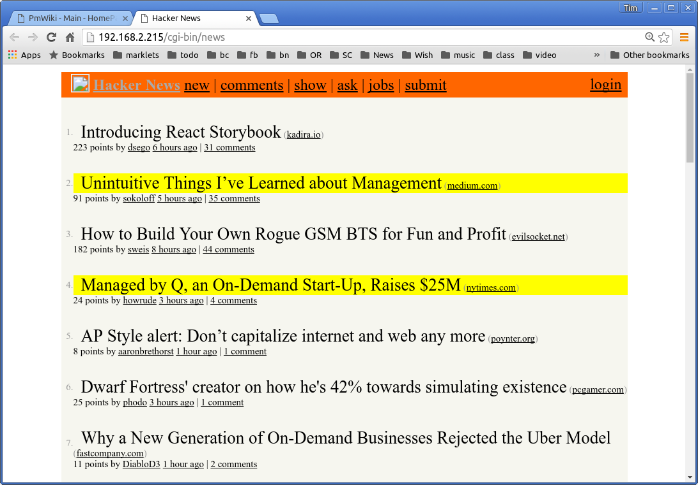

# hncleaner

This Perl script gets around the ad-blocking flame war by just highlighting the sites in your Hacker News listing that you pre-define as not wanting to visit.  This script doesn't block anything.  It just injects a little extra CSS style into the Hacker News article listing.

## Why?

Hacker News really doesn't care that some news sources are paywalls or that others employ very annoying advertisements.  I wrote this script after visiting one site whose text would jump around to make room for a video ad, after I started scrolling past the fourth or fifth paragraph.

## Install

    1) Edit the "news" script to add your own sites.
    2) Drop the "news" script in your /usr/bin/cgi-bin/ folder and point your browser at it.

## Screenshot

